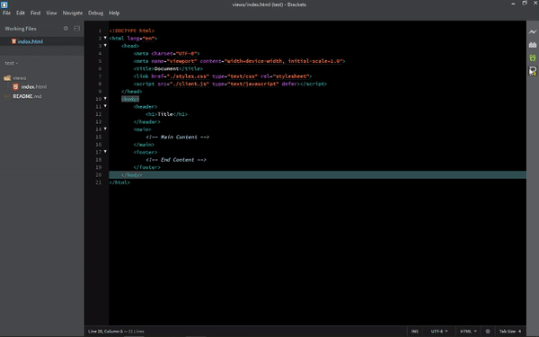

Project Helper for Brackets
===============================

A nice way of creating new folders and files in a project. Templates can also be used on files.

## How to use
 - click on the Project Helper icon in the toolbar
 - choose folder or file creation
 - write designated path and name
 - click ok and voila!

## How to get
Go to Brackets' Extension Manager(EM) and either:
 - search by name and install,
 - use this github url and paste to EM link,
 - or upload manually with this repo's zip file.

---

> Feel free to clone this repo to change/add templates for your own use or in anyway you see fit. Make sure after changing `templates/` folder you also change `dialog/file.html` options and `main.js` switch cases appropriately.