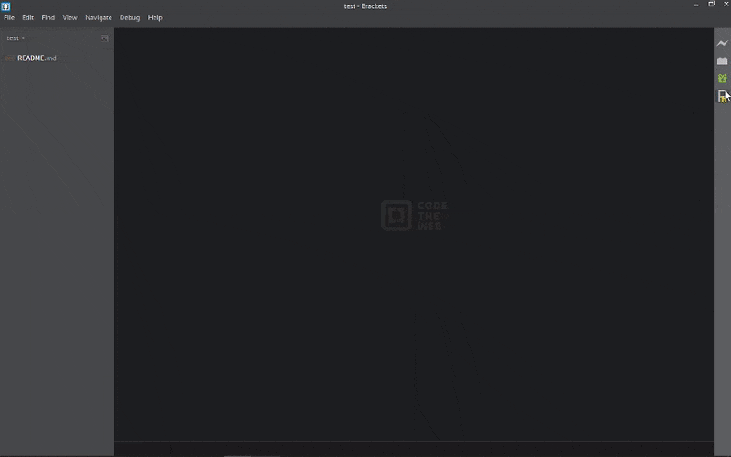

Project Helper for Brackets
===============================

A nice way of creating new folders and files in a project. Templates can also be used on files.

## Installing the Extension
Go to Brackets' Extension Manager(EM) and either:
- search by name and install,
- use this github url and paste to EM link,
- or upload manually with this repo's zip file.

## Using the Extension
1. click on the Project Helper icon (Ph) in the toolbar
2. write designated folder name(s) and a file name (one can be optional)
    - if folder names are excluded, the file will be made in the root directory
    - if the file name is excluded, the folder(s) will be created if not already
    - can create nested folders, i.e.:
        - folder `src` does not yet exist
        - submiting `src/js` will create folder `src` with sub-folder `js`
        - submiting `src/js` and `script.js` will create `script.js` in `js`
        - it wont create `src/js` folders because they exist from previous submission
3. click **OK** to create!
 
## Add a template
Part I:
- create a folder with the title you want to see for the templates dropdown,
- in this folder will be your single file that you want to use as a template.
 
Part II:
- in Brackets editor, got to `Help > Show Extensions Folder`,
- navigate your way to `waymans-project-helper`,
- paste your folder (with the template file) into the `templates` folder,
- reload with extensions (`Debug > Reload with Extensions`) to see changes.

## Disclaimer
As this was my first Brackets extension and initially was for personal use it has not been extremely tested. It may not work on all versions/systems or with certain extensions.

---

## Notes
> Removing or changing templates will be understood by knowing the `Add a template` section
> Feel free to clone this repo to change/add templates for your own use or in anyway you see fit.
